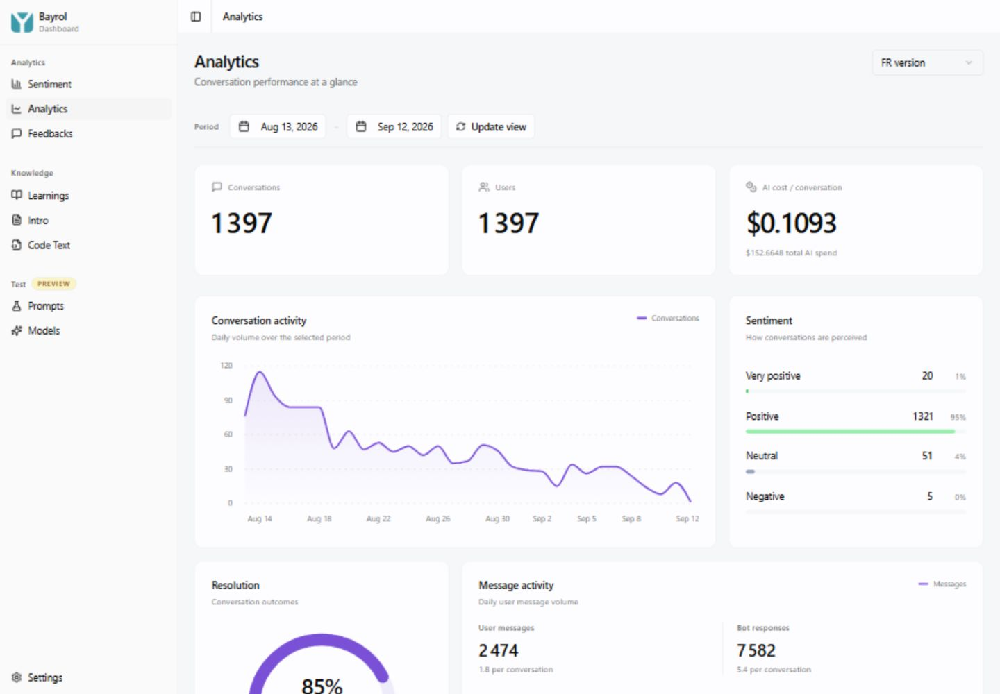
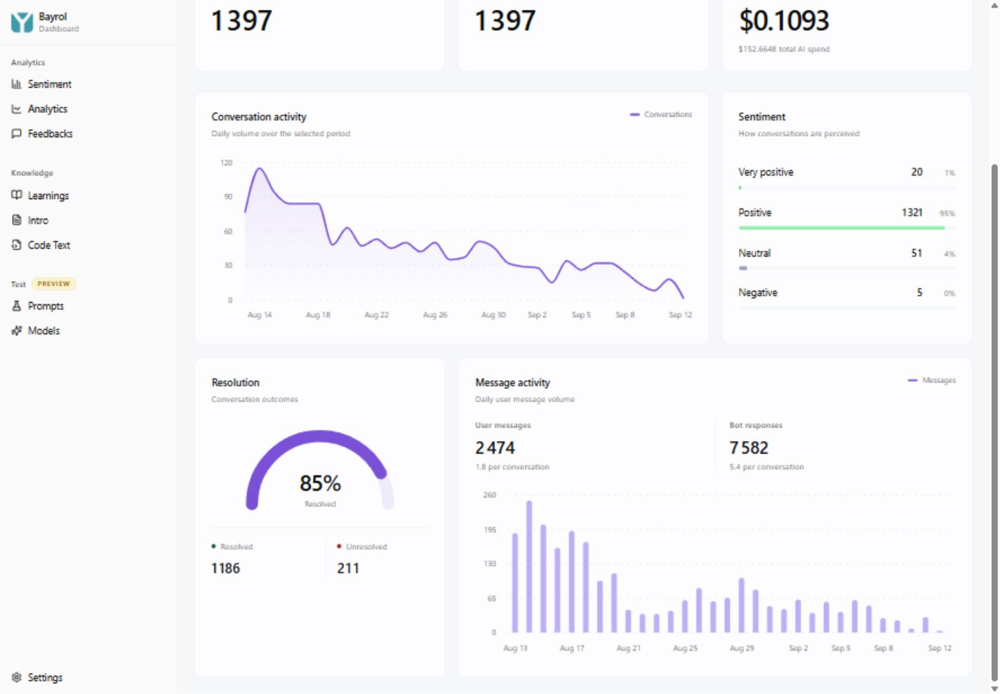
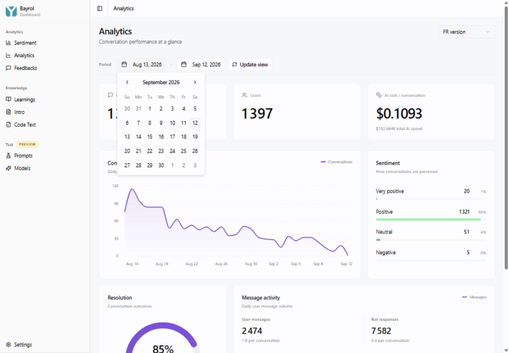
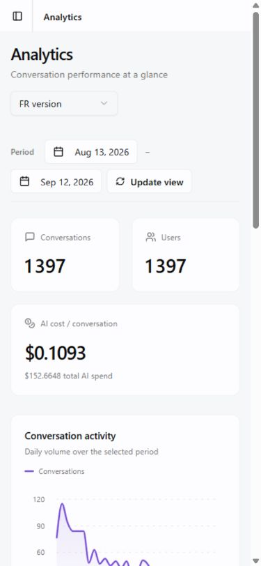

# Revue Analytics sur localhost

Écran réel observé le 12 septembre 2026, bot FR, période du 13 août au
12 septembre 2026. Revue visuelle et inspection ciblée du code, sans modification
des données, des filtres sélectionnés ou du code applicatif.

## 1. Synthèse desktop — présentation cohérente, indicateur à corriger

Les cartes sont cohérentes avec les graphiques, le coût par conversation ressort
bien et les trois valeurs sont faciles à repérer.

**Priorité haute : le compteur Users n'est pas un nombre d'utilisateurs uniques.**
Conversations et Users affichent tous les deux 1 397. L'inspection de
`src/api/botpress/analytics.ts:279-280` confirme que le code ajoute les identifiants
de conversation dans l'ensemble nommé `uniqueUsers`. Ce n'est donc pas simplement
une coïncidence sur cette période.

Proposition : ne plus présenter cette mesure comme un compteur d'utilisateurs.
Sans ajouter de nouvelle donnée ni modifier le backend, masquer cette carte est
plus honnête que la conserver. Un véritable compteur nécessite ensuite une source
utilisateur fiable, à traiter séparément.

Polissage secondaire : conserver quatre décimales pour le petit coût unitaire,
mais afficher le total monétaire à deux décimales (152,66 $ plutôt que 152,6648 $).

## 2. Graphiques et résultats — lisibles, mais arrondis et espace à améliorer

La distinction courbe / histogramme fonctionne, les infobulles donnent la date et
la valeur, et les sentiments conservent leurs libellés textuels.

- **Priorité haute : 5 conversations négatives sont affichées à 0 %.** Afficher
  0,4 % ou « < 1 % » au lieu d'un zéro trompeur. Garder le compte exact visible.
- La période inclut aujourd'hui : signaler la dernière journée comme partielle
  pour éviter de lire sa baisse comme une chute définitive d'activité.
- Le bloc Messages présente les totaux utilisateur et bot, mais son graphique
  montre seulement les messages utilisateur. Un sélecteur « Utilisateur / Bot »
  permettrait d'explorer les deux séries journalières déjà disponibles, sans
  nouvelle source de données.
- Le bloc Résolution laisse beaucoup d'espace sous ses compteurs. Mieux centrer
  son contenu et ajouter un lien discret « Voir les 211 non résolues » vers
  Sentiment, en conservant bot et période, rendrait ce bloc plus utile.

## 3. Période — accessible, mais interaction incohérente

L'ouverture du calendrier fonctionne et ses boutons ont des noms accessibles.
En revanche, le champ de début affiche le 13 août et ouvre le mois de septembre.
Il devrait s'ouvrir sur le mois de la date sélectionnée.

Propositions :

- Réunir les deux dates dans un sélecteur de plage avec raccourcis 7 j / 30 j /
  période personnalisée.
- Clarifier « Update view » : le hook change déjà de requête lorsque les dates
  changent. Renommer le bouton « Actualiser » si le filtrage reste automatique,
  ou n'appliquer la période qu'après une validation explicite.
- Remplacer le toast de succès qui recouvre le haut de l'écran lors du chargement
  normal par une indication locale discrète. Réserver les toasts aux erreurs ou
  aux actions explicites.

## 4. Mobile — pas de débordement, commandes trop dispersées

Vérifié à 390 px : les cartes et graphiques s'empilent sans débordement horizontal.
Le coût conserve une largeur suffisante.

Les deux dates et le bouton se répartissent sur deux lignes, avec un tiret isolé
après la première date. Un contrôle de période unique, pleine largeur, serait plus
lisible. Des libellés secondaires légèrement plus contrastés amélioreraient aussi
la lecture ; le contraste n'a pas été mesuré dans cette revue.

## Ordre recommandé

1. Corriger l'interprétation de Users et les pourcentages arrondis à zéro.
2. Améliorer le sélecteur de période et clarifier l'actualisation.
3. Rendre les 211 conversations non résolues accessibles depuis la jauge.
4. Ajouter le choix de série dans Messages, puis ajuster les espaces et formats.

## Limites

Captures du produit réel, pas de données de démonstration. Les chiffres affichés
et les deux points de logique mentionnés ont été inspectés, mais il n'y a pas eu
de rapprochement exhaustif avec Botpress, de test de lecteur d'écran, de mesure
de contraste, ni de test réseau sur plusieurs périodes. Aucune correction
applicative n'a été effectuée pendant cette revue.
